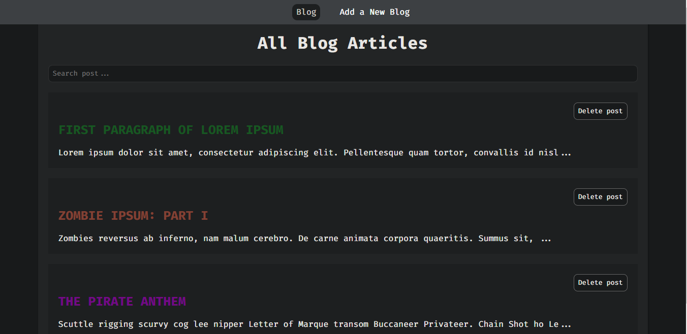
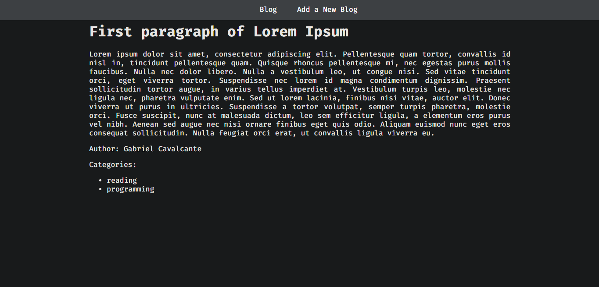

# Blog Posts

> Project created just for learning purposes

> 

> 

## Build Setup

``` bash
# install dependencies
npm install

# serve with hot reload at localhost:8080
npm run dev
```

> Project idea by Net Ninja <br> 
> Code refactoring and extras addition by Gabriel Cavalcante